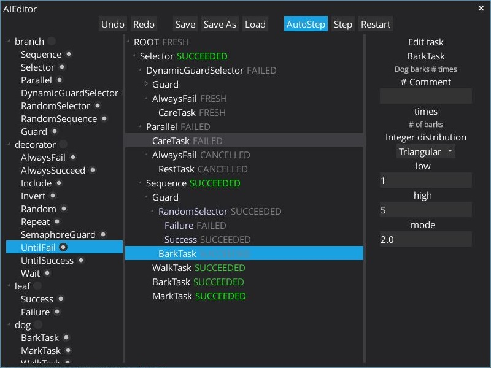

# Behavior Tree Editor v2 for [gdx-ai](https://github.com/libgdx/gdx-ai)

[](https://jitpack.io/#piotr-j/bte2)


See bte-test for example usage

This is mostly the same as libgdx project created with setup up, make sure you can run that without issues first.

Local installation is recommended. Open the project and run install task.
```
repositories { 
  ...
  mavenLocal()
}
   
project(":core") {
  ...
  dependencies {
    ...
    compile 'com.github.piotr-j:bte:0.7.3'
    // lwjgl3 required
    compile 'com.github.piotr-j:bte-window:0.7.3'
  }
}
```


You can also try jitpack:

Stick this into your build.gradle
````
   repositories { 
      ...
      maven { url "https://jitpack.io" }
   }
   dependencies {
      compile 'com.github.piotr-j.bte2:bte:0.7.1'
      // lwjgl3 required
      compile 'com.github.piotr-j.bte2:bte-window:0.7.1'
   }
````
Replace `0.7.1` with `master-SNAPSHOT` to get the latest commit on the master branch.

Read [jitpack docs](https://jitpack.io/docs/) if you have any problems!

### Screenshot

